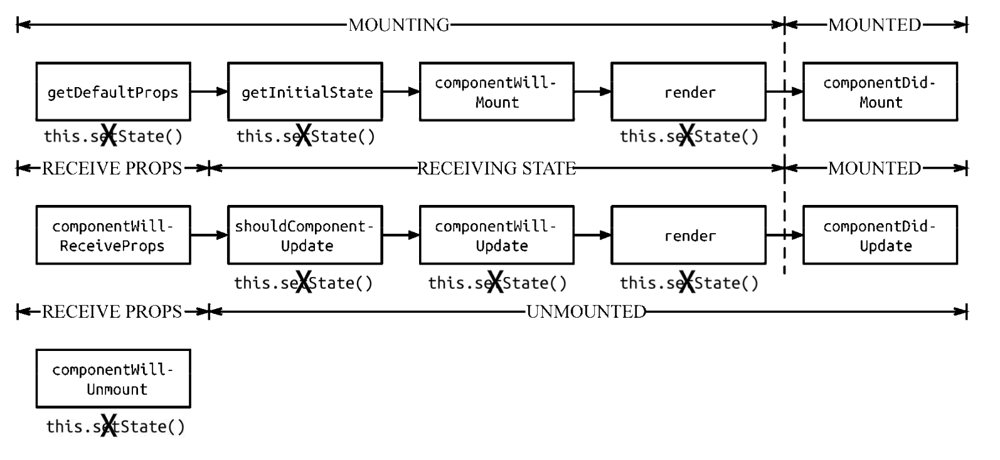

## React、Vue大比武

### 相同点
React 和 Vue 有许多相似之处，它们都有：

- 使用 Virtual DOM，有自己的diff渲染算法
- 提供了响应式 (Reactive) 和组件化 (Composable) 的视图组件。
- 将注意力集中保持在核心库，而将其他功能如路由和全局状态管理交给相关的库。

### 1、diff算法

#### React
react的diff算法分为3个策略：

  - dom节点跨层级操作很少，忽略不计
  - 拥有相同类的两个组件生成相同的树结构，不同类的两个组件生成不同的树结构
  - 同一层级的子节点通过唯一的id区分（key）

##### tree diff
为了优化效率，旧树和新树只比较同一层级的节点，遍历一次：
 - 发现节点在旧树存在，新树不存在了，直接删除节点及其下的子节点
 - 发现节点在新树存在，旧树不存在，直接创建新节点及其下的子节点
对于跨层级操作，不是移动操作，而是删除旧节点，创建新节点及其下的子节点

#### component diff
  - 组件类型不变，按照tree diff策略进行diff
  - 如果不是，则判断为dirty component，直接替换（删除+创建）
  - 用户可以通过componentShouldUpdate里判断是否进行diff算法

#### element diff
  提供3个节点操作类型：插入，移动，删除
  根据index来对比，不一样，则删除创建，一样，则跳过，操作冗余。
  这里引入唯一id（key）的概念来做性能优化
  
  - 遍历新树，通过key来判断新旧树上是否都存有相同的节点，如果有，判断当前节点的下标（index）

  ```js
    if(oldIndex < lastIndex) {
        // 不移动
    } else {
        // 移动
    }
  ```
  - 如果新树存在，旧树不存在，直接创建新节点
  - 如果旧树存在，新树不存在，直接删除新节点

#### Vue
Vue的diff算法大致和React的差不多，或者说是业界公认的虚拟dom diff算法最佳实践是：
  - 只对新旧树上同一层级的节点进行比较
  - 删除新树不存在，旧树存在的节点
  - 创建旧树不存在，新树存在的节点
不同点：

- old子节点和new子节点各有两个头尾的变量StartIdx和EndIdx，它们的2个变量相互比较，一共有4种比较方式（start->start,start->end,end->start,end->end）。

- 一旦匹配成功，真实的dom节点位置以new子节点的下标为准，创建的子节点下标以new子节点的下标为准。

- 如果4种比较都没匹配，如果设置了key，就会用key进行比较，在比较的过程中，变量会往中间靠，一旦StartIdx>EndIdx表明old子节点和new子节点至少有一个已经遍历完了，就会结束比较。

#### 总结
Vue和React的diff算法上：

- tree diff 、component的diff是很接近的，都是删除新树不存在，旧树存在的节点，创建旧树不存在，新树存在的节点。
- 在element diff上
  - React采用的是基于key的顺序优化，从左到右依次比对，oldIndex < lastIndex ？ 移动 ： 不移动。
  - Vue采用的是首尾对比。位置都以新节点下标为准

### 2、生命周期

 - Vue的生命周期


 - React的生命周期


- react
  - first Render : getDefaultProps -> getInitialState -> componentWillMount -> render -> componenntDidMount
  - state change : shouldComponentUpdate -> componentWillUpdate -> render ->componentDidUpdate
  - props change : componentWillReceiveProps -> shouldComponentUpdate -> componentWillUpdate -> render ->componentDidUpdate
  - Unmount      : componentWillUnmount
  - second Render: getInitialState -> componentWillMount -> render -> componenntDidMount

- Vue
  - first Render : beforeCreate -> data -> created -> beforeMount  -> mounted
  - data change  : beforeUpdate -> updated
  - Unmount      : beforeDestory -> destoryed

### setState vs 双向绑定

- React

1、在钩子函数里调用setState


2、setState是同步？异步？

- setState 只在合成事件和钩子函数中是“异步”的，在原生事件和 setTimeout 中都是同步的。
- setState的“异步”并不是说内部由异步代码实现，其实本身执行的过程和代码都是同步的，只是合成事件和钩子函数的调用顺序在更新之前，导致在合成事件和钩子函数中没法立马拿到更新后的值，形式了所谓的“异步”。
- 可以通过第二个参数 setState(partialState, callback) 中的callback拿到更新后的结果。
- setState 的批量更新优化也是建立在“异步”（合成事件、钩子函数）之上的，在原生事件和setTimeout 中不会批量更新，在“异步”中如果对同一个值进行多次 setState ， setState 的批量更新策略会对其进行覆盖，取最后一次的执行，如果是同时 setState 多个不同的值，在更新时会对其进行合并批量更新。
- isBatchingUpdates = true 为批量更新状态

- Vue

vue官方文档示意图


大致可以分为3个阶段：

- vue在created前对data进行处理，调用defineReactive方法，用来劫持并监听所有属性，如果有变动的，就通知订阅者。
- 当订阅者收到属性的变化通知并执行相应的函数，从而通知解析器Compile。
- 解析器Compile，可以扫描和解析每个节点的相关指令，更新数据。


### 性能优化
- React
在 React 应用中，当某个组件的状态发生变化时，它会以该组件为根，重新渲染整个组件子树。
  - PureComponent + immutable + shouldComponentUpdate
  - 列表组件的key
  - Performance + react-addons-perf观察react的性能（react16不再支持）
  - Performance + Profiler观察react组件的性能（react16.5后开始支持）
  - dynamic router 

    - react-router v3 

    ```js
    export default (app, registerModel) => ({
      breadcrumbName: '',
      path: '',
      getChildRoutes(location, cb) {
        Promise.all([ import('url')])
        .then(modules => {
            cb(null, modules.map(module => module.routes(app, registerModel)))
          })
      },
      getComponents(nextState, cb) {
        import('url').then(container => {
            cb(null, container.default)
          })
      },
      onEnter(nextState, replace, callback) {}
    })

    ```
    - react-router v4 + react-loadable 

    ```js
    loadable({
        loader: this.props.loader,
        timeout: 10000,
        loading: this.props.loading || Loading
      })
    ```
- Vue

  得益于 Vue 的 响应式系统 和 虚拟 DOM 系统 ，Vue 在渲染组件的过程中能自动追踪数据的依赖，并精确知晓数据更新的时候哪个组件需要重新渲染，渲染之后也会经过虚拟 DOM diff 之后才会真正更新到 DOM 上，Vue 应用的开发者一般不需要做额外的优化工作。

  - 扁平化vuex store树
  - 路由懒加载
    ```js
    new VueRouter({
      routes: [
        { path: '/foo', component: () => import('./Foo.vue') }
      ]
    })
    ```