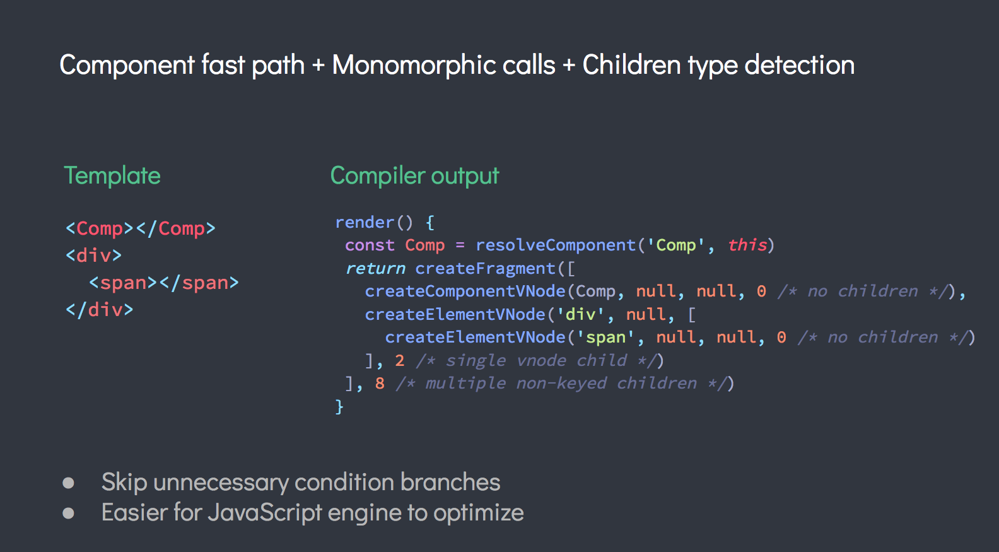
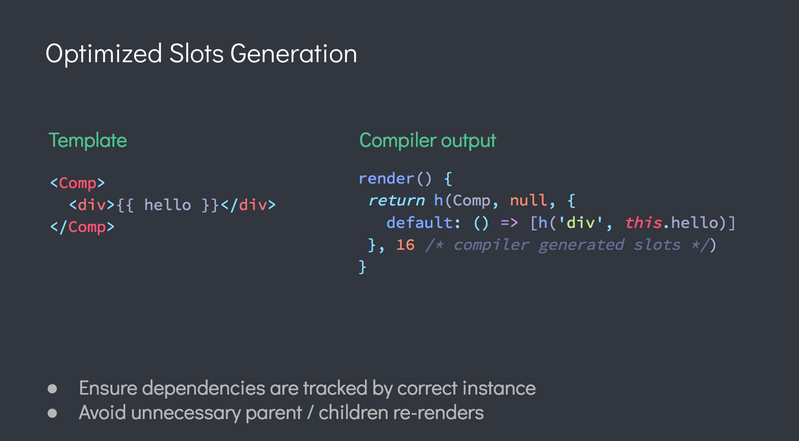
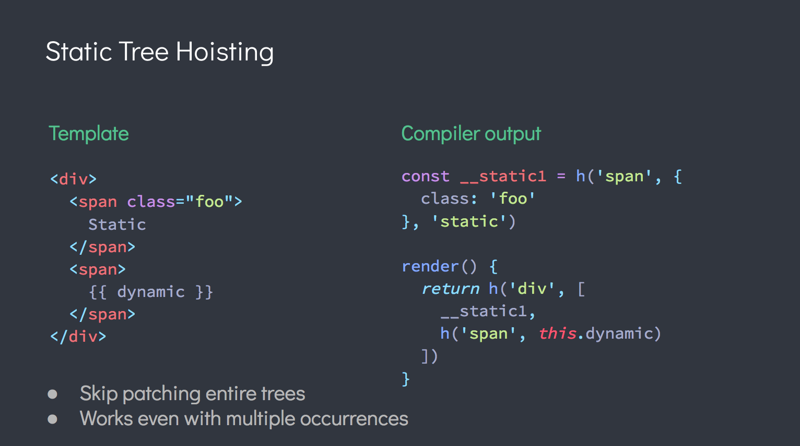
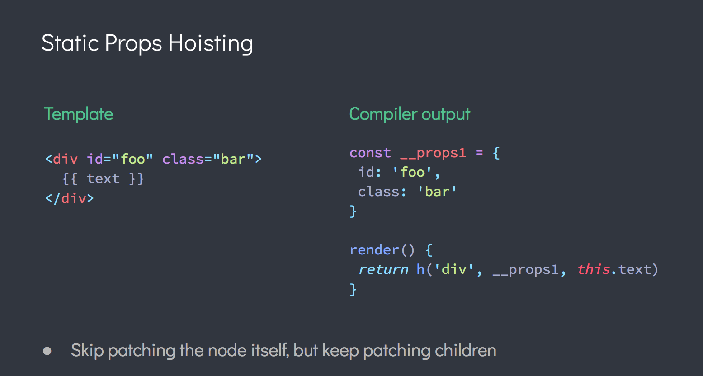
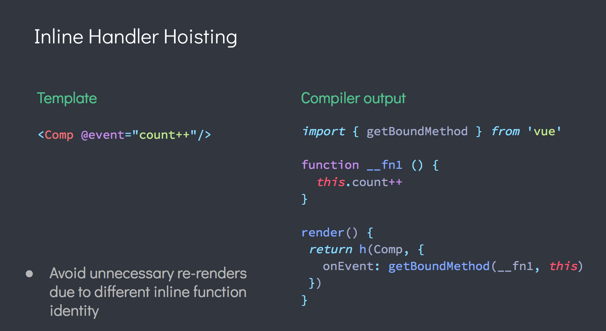
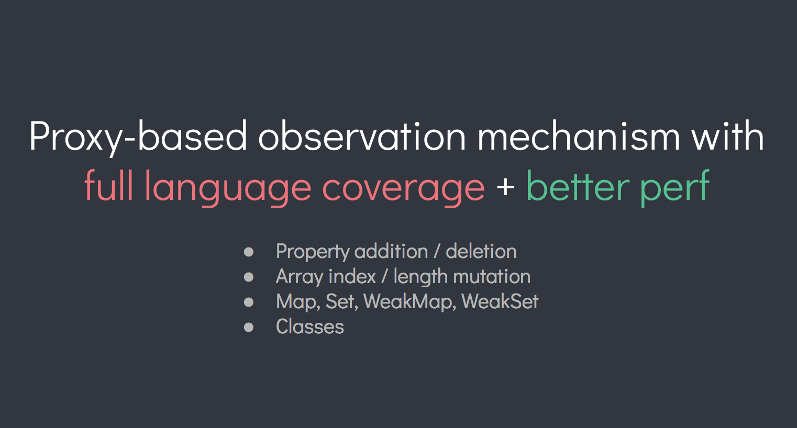
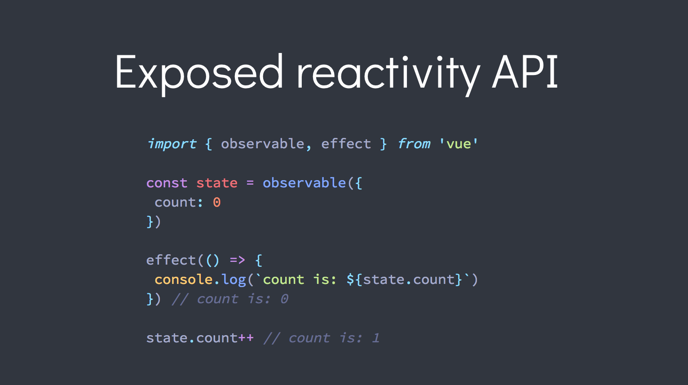
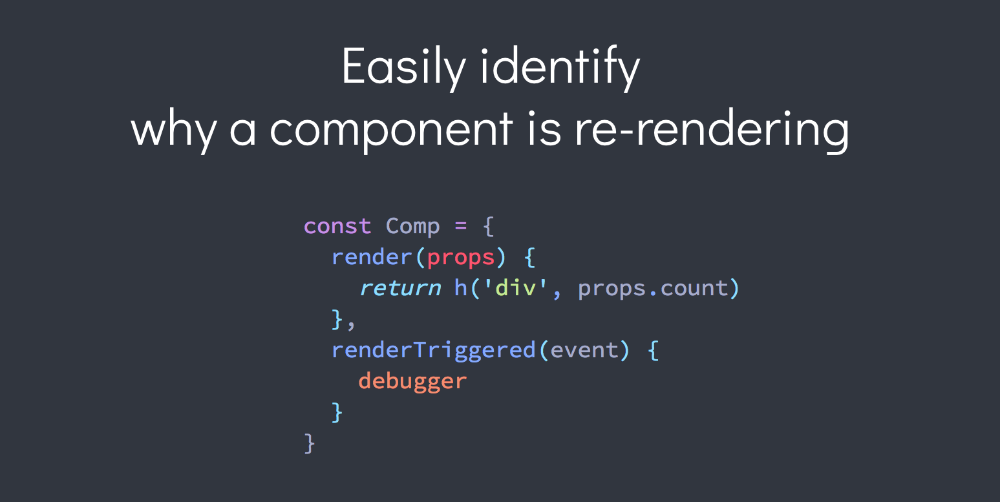
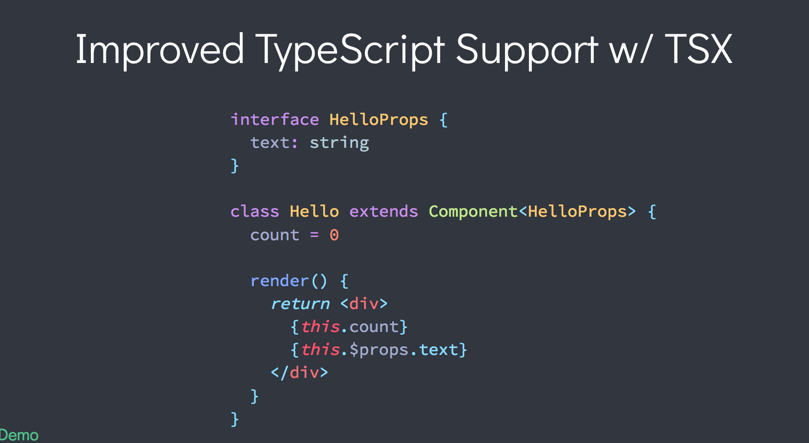

### 前言

Evan You（尤雨溪）在2018年11月16日早上在 Vue Toronto 的主题演讲中预演了 Vue 3.0的新特性 。利用现代浏览器支持的新功能，Vue 3 将成为我们已经了解和喜爱的 Vue.js 强大的的改进版本。

大概可以分为：
- 更快
- 更小
- 更易于维护
- 更多的原生支持
- 更易于开发使用
完整的PPT请点击：[跳转](https://docs.google.com/presentation/d/1yhPGyhQrJcpJI2ZFvBme3pGKaGNiLi709c37svivv0o/edit#slide=id.g4689c30700_0_191)

### 翻译
#### 更快

1、虚拟 DOM 重写，mounting和patching的速度提高100％
2、更多的编译时的提示来减少运行时的开销
3、组件快速路径+单个调用+子类型检测
- 跳过不必要的条件分支
- JS引擎更容易优化

4、优化插槽的生成
- 确保实例正确的跟踪依赖关系
- 避免不必要的父子组件重新渲染

5、静态树提升
- 跳过修补整棵树，从而降低渲染成本
- 即使多次出现也能正常工作

6、静态属性提升
- 跳过不会改变节点的修补过程，但是它的子组件会保持修补

7、内联的事件提升
- 避免因为不同的内联函数标识而导致的不必要的重新渲染

8、基于Proxy的观察者机制，全语言覆盖+更好的性能
- 目前vue使用的是Object.defineProperty 的 getter 和 setter
- 组件实例初始化的速度提高100％
- 使用Proxy节省以前一半的内存开销，加快速度，但是存在低浏览器版本的不兼容
- 为了继续支持 IE11，Vue 3 将发布一个支持旧观察者机制和新 Proxy 版本的构建

#### 更小
- 更友好的tree-shaking
- 新的core runtime 压缩后大概 10kb

### 更加可维护

- Flow -> TypeScript
- 包的解耦
- 编译器重写
  - 可插拔的架构
  - 提供更强大的IDE支持来作为基础设施

### 提供更方便的原生支持

运行时内核也将与平台无关，使得 Vue 可以更容易地与任何平台（例如Web，iOS或Android）一起使用

### 更方便的开发
- 暴露响应式的api

- 轻松识别组件重新渲染的原因

- 提供对TypeScript的支持（TSX）

- 更友好的warning traces
  - 现在包括功能组件
  - 可检查的props
  - 在更多的警告中提供可用的traces

### 实验性的 Hooks API
类似react hook的API，[详情可以见](https://github.com/yyx990803/vue-hooks)
### 实验性的 Time Slicing 支持
当许多组件同时尝试重新渲染时,浏览器都会变得很慢，利用Time Slicing将JS执行分为几部分,此时，用户的交互不会被阻塞

### 参考
https://www.css88.com/archives/10052