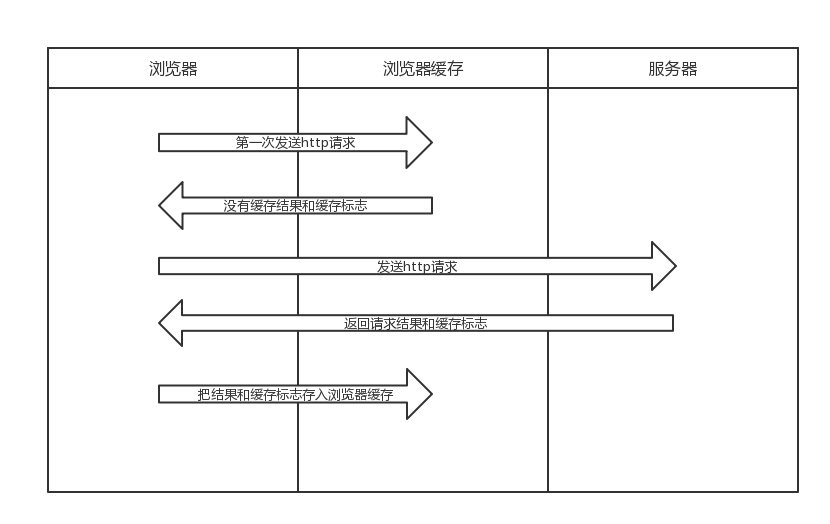

## 前文
在前端开发中，性能一直都是被大家所重视的一点，然而判断一个网站的性能最直观的就是看网页打开的速度。其中提高网页反应速度的一个方式就是使用缓存。一个优秀的缓存策略可以缩短网页请求资源的距离，减少延迟，并且由于缓存文件可以重复利用，还可以减少带宽，降低网络负荷。

## 缓存过程分析


由此可知：
- 浏览器每次发送请求前，都会从浏览器缓存中查找缓存及其缓存标识
- 浏览器每次请求到数据后，都会将数据及其缓存标识存入浏览器缓存

## 缓存规则

1、强制缓存阶段：先在本地查找该资源，如果有发现该资源，而且该资源还没有过期，就使用这一个资源，完全不会发送http请求到服务器

2、协商缓存阶段：如果在本地缓存找到对应的资源，但是不知道该资源是否过期或者已经过期，则发一个http请求到服务器,然后服务器判断这个请求，如果请求的资源在服务器上没有改动过，则返回304，让浏览器使用本地找到的那个资源；

3、启发式缓存阶段

4、缓存失败阶段：当服务器发现请求的资源已经修改过，或者这是一个新的请求(在本来没有找到资源)，服务器则返回该资源的数据，并且返回200， 当然这个是指找到资源的情况下，如果服务器上没有这个资源，则返回404。

## 缓存标识

### 1、强制缓存阶段
由上面可以知道强制缓存是直接使用本地的缓存，不发送http请求，那么判断它是否要进行强制缓存的标志是什么呢？
- Expires http1.0

Expires是HTTP/1.0控制网页缓存的字段，其值为服务器返回该请求结果缓存的到期时间(绝对时间)，即再次发起该请求时，如果客户端的当前时间小于Expires的值时，直接使用缓存结果。

缺点：因为是绝对时间，如果客户端与服务端的时间因为某些原因（例如时区不同；客户端和服务端有一方的时间不准确）发生误差，强缓存可能直接失效。

```js
  app.get('/1.jpg',function(req,res,next){
    ...
    res.setHeader('Expires', new Date(Date.now() + 10 * 1000).toUTCString())
  })
```

- Cache-Control http1.1

在HTTP/1.1中，Cache-Control是最重要的规则，主要用于控制网页缓存，它有几个选项：
  1、public  : 所有的内容都被缓存（客户端和代理服务器都可缓存）
  2、private : 所有的内容都被缓存（客户端缓存，cache-control的默认值）
  3、no-cache: 客户端缓存，但是是否使用缓存得通过协商缓存来决定
  4、no-store: 所有内容都不缓存，既不强制缓存，又不协商缓存
  5、max-age=num(num的单位是秒) : 缓存内容在num秒后失效，num为相对时间

```js
  app.get('/2.jpg',function(req,res,next){
          res.setHeader('Expires', new Date(Date.now() + 10 * 1000).toUTCString())
          res.setHeader('Cache-Control', 'max-age=20')
          ...
  })
```

经过强缓存后，客户端再请求，如果缓存标志有效，则返回灰色200，数据从浏览器缓存中取出。
优先级：Cache-Control > expires

### 2、启发式缓存阶段
当缓存过期时间的字段一个都没有的时候，浏览器下次并不会直接进入协商阶段，而是先进入启发式缓存阶段，你可以通过关闭服务器，刷新页面来观察。
它根据响应头中2个时间字段 Date 和 Last-Modified 之间的时间差值，取其值的10%作为缓存时间周期。
也就是说，当存有 Last-Modified字段的时候，即使是断网，且强缓存都失效后，也有一定时间是直接读取缓存文件的。
etag是没有这个阶段的。

### 3、协商缓存阶段
协商阶段就是当强缓存阶段失效的时候，http请求会携带缓存标志符向服务器发起请求，由服务器来决定是否使用缓存，浏览器根据返回到code码来决定是否从浏览器缓存中拿去数据。

- Last-Modified / If-Modified-Since http1.0

Last-Modified是服务器响应请求时，返回该资源文件在服务器最后被修改的时间。
If-Modified-Since是再次请求该资源文件的时候，会带上上次请求中的Last-Modified时间，服务器通过对比Last-Modified / If-Modified-Since，返回200，则有更新，从服务器拉取数据，304则使用缓存文件


```js

app.get('/3.jpg',function(req,res,next){
        ...
        let ifModifiedSince = req.headers['if-modified-since']
        let LastModified = stat.ctime.toGMTString()
        if(!!ifModifiedSince && LastModified === ifModifiedSince){
            res.statusCode = 304
            res.end()
        }
        if(!ifModifiedSince  || (!!ifModifiedSince && LastModified !== ifModifiedSince)){
            res.setHeader('Last-Modified', LastModified)
        }
        ...
    })
})

```

- Etag / If-None-Match http1.1

Etag是服务器响应请求时，返回当前资源文件的一个唯一标识(由服务器根据文件信息算法生成,类似hash)
If-None-Match是客户端再次发起该请求时，携带上次请求返回的唯一标识Etag值，通过此字段值告诉服务器该资源上次请求返回的唯一标识值。服务器收到该请求后，发现该请求头中含有If-None-Match，则会根据If-None-Match的字段值与该资源在服务器的Etag值做对比，一致则返回304，代表资源无更新，继续使用缓存文件；不一致则重新返回资源文件，状态码为200
```js
app.get('/4.jpg',function(req,res,next){
    reponseHandle(req,res,(stat)=>{
        let ifNoneMatch = req.headers['if-none-match']
        let etag = .....
        if(!ifNoneMatch || (!!ifNoneMatch && ifNoneMatch!== etag)){
            res.setHeader('ETag', etag)
        }
        if(!!ifNoneMatch && ifNoneMatch === etag){
            res.statusCode = 304
            res.end()
        }
        
    })
})

```

Etag / If-None-Match优先级高于Last-Modified / If-Modified-Since，同时存在则只有Etag / If-None-Match生效

由此可见，强制缓存优先于协商缓存进行，若强制缓存(Expires和Cache-Control)生效则直接使用缓存，若不生效则进行协商缓存(Last-Modified / If-Modified-Since和Etag / If-None-Match)，协商缓存由服务器决定是否使用缓存，若协商缓存失效，那么代表该请求的缓存失效，重新获取请求结果，再存入浏览器缓存中；生效则返回304，继续使用缓存

### 4、一些常见且需要知道的标识符

|    字段    |                  说明                    |
|:----------|:-----------------------------------------|
|   pragma  |http1.0,值为no-cache为禁用缓存              |
|   vary    |基于字段区分缓存版本（res header）            |
|   Date    |发送响应报文的时间（启发式缓存、代理服务器缓存）  |
|   Age     |文件存于服务器的时间                         |
|accept-encoding |请求服务器返回的文件类型                 |
|referer    |       发送请求的源域名                      |   

## 服务器缓存
### CDN缓存
CDN缓存，也叫网关缓存、反向代理缓存。浏览器先向CDN网关发起WEB请求，网关服务器后面对应着一台或多台负载均衡源服务器，会根据它们的负载请求，动态地请求转发到合适的源服务器上。

CDN的优势：
 - CDN节点解决了跨运营商和跨地域访问的问题，访问延时大大降低
 - 大部分请求在CDN边缘节点完成，CDN起到了分流作用，减轻了源站的负载。
 - 通过http响应头中的Cache-control: max-age的字段来设置CDN边缘节点数据缓存时间

## HTML5缓存
### app cache
因为几个历史原因，app cache已经不推荐使用，从web标准移除了。原因如下：
 - 使用了manifest后，没办法清空这些缓存，只能更新缓存，或者得用户自己去清空浏览器的缓存；
 - 假如更新的资源中有一个资源更新失败了，那么所有的资源就会全部更新失败，将用回上一版本的缓存；
 - 主页会被强制缓存(使用了manifest的页面)，并且无法清除；
 - appache文件可能会无法被及时更新，因为各大浏览器对于appcache文件的处理方式不同；

### service worker
Service workers 本质上充当Web应用程序与浏览器之间的代理服务器，也可以在网络可用时作为浏览器和网络间的代理。它们旨在（除其他之外）使得能够创建有效的离线体验，拦截网络请求并基于网络是否可用以及更新的资源是否驻留在服务器上来采取适当的动作。他们还允许访问推送通知和后台同步API。

service worker的特点：
- 要求 HTTPS 环境，开发过程中，一般浏览器也允许 host 为 localhost 或者 127.0.0.1
- 运行在它自己的全局脚本上下文中
- 不绑定到具体的网页，无法修改网页中的元素，因为它无法访问 DOM
- 一旦被 install，就永远存在，除非被手动 unregister
- 异步实现，内部大都是通过 Promise 实现，依赖 HTML5 fetch API
- Service Worker 的缓存机制是依赖 Cache API 实现的

具体请[移步](https://github.com/asyalas/blog/blob/master/2018/blog/PWA%E4%BB%8E%E5%85%A5%E9%97%A8%E5%88%B0%E6%94%BE%E5%BC%83.md)

### Cookie
- Cookie大小在4k左右
- http请求会默认带上
- 域名、端口相同即可共享（CSRF）
- 一般不直接使用，会进行简单的封装，请[移步](https://github.com/asyalas/blog/blob/master/2018/blog/js-cookie%E6%BA%90%E7%A0%81%E9%98%85%E8%AF%BB.md)
- Cookie的常见属性  

|    key    |                    value                        |
|:----------|:------------------------------------------------|
|   expires |Cookie失效时间(绝对时间)若不设置，浏览器关闭即删除      |
|   Max-Age |Cookie失效时间，相对时间,优先级高于expires            |
|   path    |设置哪些路径带上cookie，一般默认为'／'                |
|   Domain  |设置哪些域名带上cookie，一般为当前一级域名             |
|   Secure  |只在https下才能发送cookie                          |
|   HttpOnly|js脚本获取不到，且只能在http上才能发送cookie（防止xss） |
|   SameSite|是否可能作为第三方 cookie（防止CSRF）                 |

### localStorage、sessionStorage
相同点

  - 存储大小都在5M左右
  - 会返回一个bol来标识是否存储成功
  - 同源策略限制
  - 不能直接和服务器通信，可以通过脚本注入请求参数里面

不同点

  - localStorage存储数据永久性直到人为删除、sessionStorage和窗口的生命周期相同
  - localStorage满足同源策略可以跨窗口存储，sessionStorage不行