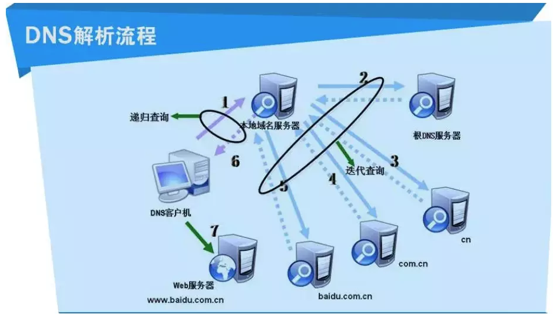
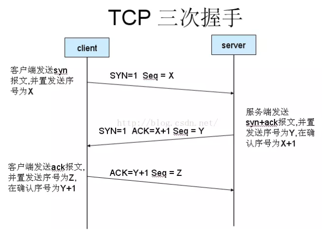
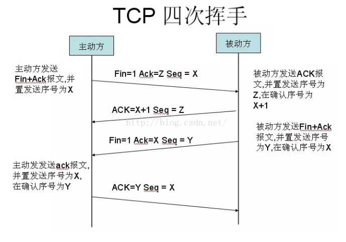

## 前言

最近在研究如何优化首屏白屏时间，大致分为网络部分和js渲染部分，该文章主要是梳理一下从输入url开始，从客户端到服务端会发生哪些事情，从哪些地方可以做优化。

## 浏览器输入url后发生的过程
1. 输入一个url地址
url遵守一定的语法规则：scheme://host.domain:port/path/filename
  - scheme：定义因特网服务的类型（协议），常见的有http，https，file，ftp等
  - host：定义域主机（http一般默认的是www）
  - demain：定义因特网域名，如baidu.com
  - post：端口号（http一般是80，https一般是443）

2. 浏览器会先查看浏览器缓存--系统缓存--路由缓存，如有存在缓存，就直接显示。如果没有，接着第三步

3. 浏览器查找域名的ip地址(DNS,域名和ip的映射分布式数据库)
大致可以分为几部：
  - 浏览器缓存 
    浏览器会缓存DNS记录一段时间，且不同的浏览器的缓存时间不同
  - 系统缓存 
    如果在浏览器缓存里没有找到需要的记录，浏览器会做一个系统调用（windows里是gethostbyname）。这样便可获得系统缓存（host）中的记录。
  - 路由器缓存
    查询请求发向路由器，它一般会有自己的DNS缓存。
  - ISP DNS 缓存
    ISP是互联网服务提供商(Internet Service Provider)的简称，ISP有专门的DNS服务器应对DNS查询请求。
  - 根服务器（递归搜索）
    ISP的DNS服务器还找不到的话，它就会向根服务器发出请求，进行递归查询（DNS服务器先问根域名服务器其的IP地址，然后再问.com域名服务器，依次类推）

  

  CDN(Content Delivery Network)就是利用DNS的重定向技术，DNS服务器会返回一个跟用户最接近的点的IP地址给用户，CDN节点的服务器负责响应用户的请求，提供所需的内容。

  针对DNS的优化大致方向是减少DNS解析的时间，即尽量通过浏览器对dns的缓存机制来减少对ip的查询，即减少需要解析的域名的个数

4. 浏览器给web服务器发送一个HTTP（HTTPS）请求
  - TCP三次握手
  浏览器获得 IP 地址后，就会对目标服务器发起建立 TCP 连接的请求，建立连接主要有三个步骤，一般称为客户端与服务器端的三次握手：
    第一次握手： 建立连接时，客户端发送syn包（syn=j）到服务器，并进入SYN_SENT状态，等待服务器确认； 
    第二次握手： 服务器收到syn包，必须确认客户的SYN（ack=j+1），同时自己也发送一个SYN包（syn=k），即SYN+ACK包，此时服务器进入SYN_RECV状态；
    第三次握手： 客户端收到服务器的SYN+ACK包，向服务器发送确认包ACK(ack=k+1），此包发送完毕，客户端和服务器进入ESTABLISHED（TCP连接成功）状态，完成三次握手。
  
  
  - TCP四次挥手
  客户端或服务器均可主动发起挥手动作

    第一次挥手: 主动关闭方，将FIN置为1，Seq设置为Z为上一次对方传送过来的Ack值，Ack设置为X为Seq值+1。设置好以上值后，将数据发送至被动关闭方(这里标记为：B)。然后A进入FIN_WAIT_1状态。

    第二次挥手：B收到了A发送的FIN报文段，向A回复，Ack设置为第一次挥手中的Seq值+1，Seq设置为Y第一次挥手中的Ack值。然后B进入CLOSE_WAIT状态，A收到B的回复后，进入FIN_WAIT_2状态。

    第三次挥手：B再次向A发送报文，将FIN置为1，Ack设置为X+1第二次挥手中的Ack值，Seq设置为Y第二次挥手中的Seq值。然后B进入LAST_ACK状态，A收到B的报文后，进入TIME_WAIT状态。

    第四次挥手：A收到B发送的FIN报文段，Ack设置为Y第三次挥手中的Seq值+1，Seq设置为X+1第三次挥手中的Ack值。然后A进入TIME_WAIT状态，B在收到报文后进入CLOSED状态，A在发送完报文等待了2MSL时间后进入CLOSED状态。

  
  - HTTPS（http+ssl）的非对称加密和对称加密
    - 非对称加密
      握手过程中，服务器会发出一张证书（带着公钥），客户端用公钥加密了一段较短的数据S，并返回给服务器。服务器用私钥解开，拿到S。此时，握手步骤完成，S成为了一个被安全传输到对方手中的对称加密密钥。此后，服务器与请求响应，只需要用S作为密钥进行一次对称的加密就好。
      证书包含公钥，所以拿到证书意味着就拿到了对方的公钥

    - 对称加密
      约定加密密钥，请求的数据用密钥加密，服务器用密钥解密
      
    一次完整的https请求：
    1、客户端向服务器发送https请求（443端口）
    2、tcp三次握手建立tcp连接
    2、服务器端返回一个安全证书（公钥）
    3、客户端收到，并进行验证，如果没有问题，就用安全证书（公钥）加密一个随机值。并发送给服务端
    4、服务端用私钥解密，拿到该随机值
    5、后面的通信就可以通过随机值用对称加密的方式进行了

  - http默认自带cookie
    在http请求中，cookie是默认自带的，可以通过设置cookie的HttpOnly和Secure属性来进行控制，详情请[移步](https://github.com/asyalas/blog/blob/master/2018/blog/%E6%B5%85%E8%B0%88%E6%B5%8F%E8%A7%88%E5%99%A8%E7%9A%84%E7%BC%93%E5%AD%98%E6%9C%BA%E5%88%B6.md)
  - 请求头自带的与tcp相关的属性
    - Connection
    Connection 头（header） 决定当前的事务完成后，是否会关闭网络连接。如果该值是“keep-alive”，网络连接就是持久的，不会关闭，使得对同一个服务器的请求可以继续在该连接上完成。
    在http1.0的时候Connection的值默认为close
    在http1.1的时候Connection的值默认为Keep-Alive
  - 浏览器会自发做的事
    浏览器能安全的添加斜杠,如www.baidu.com ->www.baidu.com/ ,而www.baidu.com/222 ->www.baidu.com/222不会，因为浏览器不清楚222是文件夹还是文件
  优化 ： 
  - 通过部署cdn来减缓数据返回的事件
  - 优化握手次数
  - 在头部设置Accept-Encoding类型，通过返回gzip来减少数据体积
  - 通过设置http缓存来优化性能，[请移步](https://github.com/asyalas/blog/blob/master/2018/blog/%E6%B5%85%E8%B0%88%E6%B5%8F%E8%A7%88%E5%99%A8%E7%9A%84%E7%BC%93%E5%AD%98%E6%9C%BA%E5%88%B6.md)

5. 永久重定向响应
为了优化搜索引擎，把多个域名进行归类，如把baidu.com,www.baidu.com,https://www.baidu.com归类
返回301，通知浏览器跳转
6. 浏览器跟踪重定向地址，请求头不变
7. 服务器“处理”请求
8. 服务器发回一个HTML响应
9. 浏览器开始显示HTML
  - 处理HTML标记，构建DOM树。
  - 处理CSS标记，构建CSSOM树。
  - 将DOM树和CSSOM树融合成渲染树（会忽略不需要渲染的dom）。
  - 根据渲染树来布局，计算每个节点的几何信息。
  - 在屏幕上绘制各个节点。
  - 中间遇到各种资源时，会进行资源的下载
  可能存在问题：
  - 资源下载
    - css下载时会阻塞渲染（带有media属性除外，不会阻塞浏览器解析）。
    - 遇到 script	标签时，DOM构建停止，此时控制权移交至js，直到脚本（下载）执行完毕，此时浏览器有优化一般会下载其他资源，但是不会解析。如果js中有对CSSOM的操作，还会先确保CSSOM已经被下载并构建。
    - 图片资源下载不会产生阻塞。
  - 重绘重排导致重新进行渲染树的生成
    - 重排（回流）：会重新计算布局，通常由元素的结构、增删、位置、尺寸变化引起，如：img下载成功后，替换填充页面img元素，引起尺寸变化；也会由js的属性值读取引起，如读取offset、scroll、cilent、getComputedStyle等信息。
    - 重绘：简单外观的改变会引起重绘，如颜色变化等。
    - 重排一定重绘。
  优化：
  - dom
    - 简化dom结构，减少DOM树和渲染树构建成本，减少页面元素个数
    如使用列表表格数据分页，简单表格不要使用复杂第三方组件等方式。
  - js
    - 将js脚本标签放在页面body底部，减少对其他过程的阻塞。
      延迟执行：对不修改页面的外链script使用defer属性，使脚本并行下载不阻塞，下载后不立刻执行，而在所有元素解析之后执行。
      这里简单的介绍下defer和async的区别：
      相同点：
      - 加载文件时不阻塞页面渲染
      - 对于inline的script（内联脚本）无效
      - 使用这两个属性的脚本中不能调用document.write方法
      - 有脚本的onload的事件回调
      不同点：
      - html的版本html4.0中定义了defer；html5.0中定义了async
      - 每一个async属性的脚本都在它下载结束之后立刻执行，可能会打乱原有的顺序
      - 每一个defer属性的脚本都是在页面解析完毕之后，按照原本的顺序执行
    - 减少和合并不必要的dom相关操作，如使用DocumentFragment、修改classname而不是各项style等，减少对重绘和重排的触发。
  - css
    - 将css放入head中，提前加载，并防止html渲染后重新结合css引起页面闪烁。
    - 减少css层级和css选择器复杂度，提高解析速度，虽然浏览器有优化。
    - 使用更高性能的css样式，如flex代替float。
    - 开启复合层，如使用3d变换、opacity等，使该元素及其子元素不导致外部的重排，但是也有坑。
    - 合理使用脱离文档流的样式，减少对外部重排的影响，如absolute。
  - 文件数量
    - 减少首次下载的文件数量大小.
    使用图片懒加载，js的按需加载等方式，使用storage存储进行js、css文件的缓存(PWA)。
    - 拆分页面资源，首屏数据优先加载等。
    动态路由、懒加载
10. 浏览器发送获取嵌入在HTML中的静态资源
11. 浏览器发送异步（AJAX）请求

