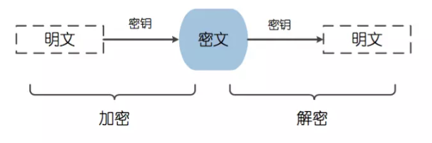
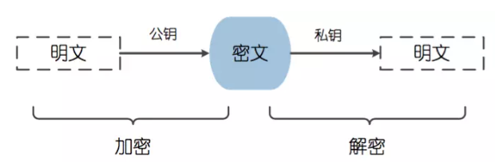

### 目录

- HTTP缓存
- 目前HTTP现存的问题
- TLS／SSL
- 常见的签名加密算法
  - 对称加密
  - 非对称加密
  - 其他常见的签名加密算法

### HTTP缓存

参考[浅谈浏览器的缓存机制](../../../2018/blog/浅谈浏览器的缓存机制.md)

### 目前HTTP现存的问题

- 明文传输

HTTP1.x在传输数据时，所有传输的内容都是`明文`，客户端和服务器端都无法验证对方的身份，这在一定程度上无法保证数据的安全性。

- 线头阻塞

可同时发送多个请求(pipeline：HTTP 管线化)，但是服务器必须严格按照请求的先后顺序返回响应，若第一个请求的响应迟迟不能返回，那后面的响应都会被`阻塞`，也就是所谓的队头阻塞

- header携带内容过大

HTTP1.x在使用时，header里携带的内容过大，在一定程度上增加了传输的成本，并且每次请求header基本不怎么变化，尤其在移动端增加用户流量。

### TLS／SSL

- HTTPS 协议使用 ca 申请证书，由于免费证书较少，需要一定费用。
- HTTP 是明文传输，HTTPS 则是具有安全性的 SSL 加密传输协议。
- HTTP 和 HTTPS使用的是完全不同的连接方式，用的端口也不一样，前者是 80，后者是 443。

### 常见的加密算法

#### 对称加密

对称加密算法 是应用较早的加密算法，又称为 共享密钥加密算法。在 对称加密算法 中，使用的密钥只有一个，发送 和 接收 双方都使用这个密钥对数据进行 加密 和 解密。这就要求加密和解密方事先都必须知道加密的密钥。

#### 非对称加密

非对称加密算法，又称为 公开密钥加密算法。它需要两个密钥，一个称为 `公开密钥` (public key)，即 公钥，另一个称为 `私有密钥` (private key)，即 私钥。
因为 加密 和 解密 使用的是两个不同的密钥，所以这种算法称为 非对称加密算法。

#### 其他常见的签名加密算法

- MD5算法

MD5 用的是 哈希函数，它的典型应用是对一段信息产生 信息摘要，以 防止被篡改。严格来说，MD5 不是一种 加密算法 而是 `摘要算法`。无论是多长的输入，MD5 都会输出长度为 128bits 的一个串 (通常用 16 进制 表示为 32 个字符)。

- SHA1算法
  
SHA1 是和 MD5 一样流行的 `消息摘要算法`，然而 SHA1 比 MD5 的 安全性更强。对于长度小于 2 ^ 64 位的消息，SHA1 会产生一个 160 位的 消息摘要。基于 MD5、SHA1 的信息摘要特性以及 不可逆 (一般而言)，可以被应用在检查 文件完整性 以及 数字签名 等场景。

- HMAC算法
  
HMAC 是密钥相关的 `哈希运算消息认证码`（Hash-based Message Authentication Code），HMAC 运算利用 `哈希算法` (MD5、SHA1 等)，以 一个`密钥` 和 一个`消息` 为输入，生成一个 消息摘要 作为 输出。
HMAC 发送方 和 接收方 都有的 key 进行计算，而没有这把 key 的第三方，则是 无法计算 出正确的 散列值的，这样就可以 防止数据被篡改。

- AES/DES/3DES算法

AES、DES、3DES 都是 对称 的 块加密算法，加解密 的过程是 可逆的。
  - `DES` 加密算法是一种 分组密码，以 64 位为 分组对数据 加密，它的 密钥长度 是 56 位，加密解密 用 同一算法。
  - `3DES` 是基于 DES 的 对称算法，对 一块数据 用 三个不同的密钥 进行 三次加密，强度更高。
  - `AES` 加密算法是密码学中的 高级加密标准，该加密算法采用 对称分组密码体制，密钥长度的最少支持为 128 位、 192 位、256 位，分组长度 128 位，算法应易于各种硬件和软件实现。

- RSA算法(非对称加密就是用的这种加密算法)

RSA 加密算法是目前最有影响力的 公钥加密算法，并且被普遍认为是目前 最优秀的公钥方案 之一。RSA 是第一个能同时用于 加密 和 数字签名 的算法，它能够 抵抗 到目前为止已知的 所有密码攻击，已被 ISO 推荐为公钥数据加密标准。

- ECC 

也是一种 非对称加密算法，主要优势是在某些情况下，它比其他的方法使用 更小的密钥，比如 RSA 加密算法，提供 相当的或更高等级 的安全级别。不过一个缺点是 加密和解密操作 的实现比其他机制 时间长 (相比 RSA 算法，该算法对 CPU 消耗严重)

### 参考

- [HTTP,HTTP2.0,SPDY,HTTPS你应该知道的一些事](http://www.alloyteam.com/2016/07/httphttp2-0spdyhttps-reading-this-is-enough/)
- [非对称加密与HTTPS](https://mp.weixin.qq.com/s?__biz=MzI5ODY1NTU4Ng==&mid=2247483842&idx=1&sn=ce47db7a2cad561b068b5be731688a03&chksm=eca3cbcfdbd442d9e6a6667c0ed118f01a0838c63fbaf59db531291a123e4378fe97f26e39dc&token=1174004427&lang=zh_CN#rd)
- [常见的加密算法](https://juejin.im/post/5b48b0d7e51d4519962ea383)